  

<i>I learn and try many things purely out of curiosity — focused on developing my own skills, without concerning myself with others.</i>

 

## 🕵️ Who I Am

- 🎓 Software Engineering student at **SMK Negeri Mojoagung**
- 🎮 24/7 active game player
- 🎧 Earphones always plugged in while working
- 🐍 Still diving deeper and deeper into **Python**
- 🚀 Aiming to make a real impact in modern IT development
- 🔁 Learn, try, and fail — over and over, always improving

 

## 🧰 Tech & Interests

<table width="100%">
<tr>
<td width="50%" valign="top">

**💻 Programming Languages**
 

</td>
<td width="50%" valign="top">

**📚 Frameworks & Libraries**
 

</td>
</tr>
<tr>
<td width="50%" valign="top">

**🆕 Recently Used**
 

</td>
<td width="50%" valign="top">

**🛠️ Development Tools**
 

</td>
</tr>
<tr>
<td width="50%" valign="top">

**🎮 When AFP (Away From Project)**
 

</td>
<td width="50%" valign="top">

**🔥 Recently Played**
 

</td>
</tr>
</table>

 

## ✅ Today's To-Do List

- 🎯 Playing Valorant
- 💻 Making some new projects for my GitHub repositories
- 🐱 Playing with my cat

 

## 🌐 Find Me on Social Media

